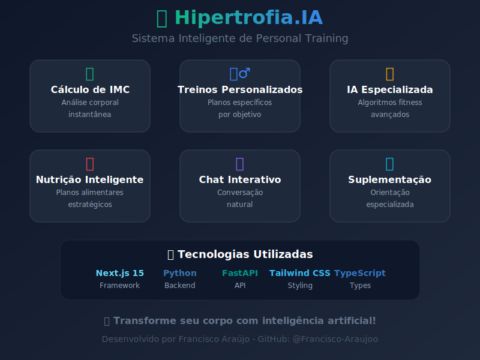

# 🤖 Hipertrofia.IA - Personal Trainer Virtual

<div align="center">
  
  
  [](https://nextjs.org/)
  [](https://python.org/)
  [](https://fastapi.tiangolo.com/)
  [](https://typescriptlang.org/)
  [](https://tailwindcss.com/)
  
  **Sistema inteligente de coaching fitness com IA para treinos personalizados, cálculo de IMC e orientações nutricionais**
</div>

---

## 📋 Índice

- [🎯 Sobre o Projeto](#-sobre-o-projeto)
- [✨ Funcionalidades](#-funcionalidades)
- [🛠️ Tecnologias](#️-tecnologias)
- [📁 Estrutura do Projeto](#-estrutura-do-projeto)
- [🚀 Como Executar](#-como-executar)
- [🔧 Configuração](#-configuração)
- [📖 Como Usar](#-como-usar)
- [🤖 IA e Algoritmos](#-ia-e-algoritmos)
- [🎨 Interface](#-interface)
- [📊 Exemplos de Uso](#-exemplos-de-uso)
- [🤝 Contribuindo](#-contribuindo)
- [📄 Licença](#-licença)

---

## 🎯 Sobre o Projeto

O **Hipertrofia.IA** é um sistema inteligente que combina ciência do exercício, análise de dados corporais e inteligência artificial para criar planos de treino e nutrição personalizados. Desenvolvido com tecnologias modernas, oferece uma experiência interativa através de chat para orientação fitness profissional.

### 🎪 **Diferenciais:**
- **IA Especializada**: Algoritmos específicos para fitness e hipertrofia
- **Cálculo Automático de IMC**: Análise corporal instantânea
- **Planos Personalizados**: Treinos adaptados ao perfil do usuário
- **Interface Moderna**: Chat intuitivo e responsivo
- **Arquitetura Híbrida**: Frontend React + Backend Python

---

## ✨ Funcionalidades

### 🏋️‍♂️ **Treinos Personalizados**
- Análise de perfil (idade, peso, altura, objetivos)
- Planos específicos por nível (iniciante, intermediário, avançado)
- Exercícios para diferentes grupos musculares
- Treinos para casa e academia

### 📊 **Análise Corporal**
- Cálculo automático de IMC
- Classificação corporal inteligente
- Recomendações baseadas nos resultados
- Metas realistas e personalizadas

### 🥗 **Orientação Nutricional**
- Planos alimentares por objetivo
- Cálculo de necessidades calóricas
- Sugestões de suplementação
- Dicas de hidratação

### 💬 **Chat Inteligente**
- Processamento de linguagem natural
- Respostas contextuais e motivacionais
- Sugestões de perguntas interativas
- Fallback offline para disponibilidade 24/7

---

## 🛠️ Tecnologias

### **Frontend**
- **Next.js 15.2.4** - Framework React para produção
- **TypeScript** - Tipagem estática
- **Tailwind CSS** - Estilização moderna e responsiva
- **Radix UI** - Componentes acessíveis
- **Lucide React** - Ícones modernos

### **Backend**
- **Python 3.8+** - Linguagem de programação
- **FastAPI** - Framework web moderno e rápido
- **Pydantic** - Validação de dados
- **Uvicorn** - Servidor ASGI de alta performance

### **IA e Processamento**
- **Algoritmos personalizados** - Lógica especializada em fitness
- **Regex patterns** - Extração de dados pessoais
- **Análise contextual** - Processamento de conversação

---

## 📁 Estrutura do Projeto

```
hipertrofia.IA/
├── 📁 app/                      # Next.js App Router
│   ├── 📁 api/
│   │   └── 📁 chat/
│   │       └── route.ts         # API Route para chat
│   ├── globals.css              # Estilos globais
│   ├── layout.tsx               # Layout principal
│   └── page.tsx                 # Página inicial
│
├── 📁 backend/                  # Backend Python
│   ├── hipertrofia_ai.py       # Lógica da IA especializada
│   ├── main.py                  # Servidor FastAPI
│   ├── requirements.txt         # Dependências Python
│   ├── start.bat               # Script Windows
│   └── start.sh                # Script Linux/Mac
│
├── 📁 components/               # Componentes React
│   ├── chat-interface.tsx      # Interface do chat
│   ├── theme-provider.tsx      # Provider de tema
│   └── 📁 ui/                  # Componentes UI (Radix)
│
├── 📁 lib/                     # Utilitários
│   └── utils.ts                # Funções auxiliares
│
├── 📁 public/                  # Arquivos estáticos
├── 📁 styles/                  # Estilos adicionais
├── package.json                # Dependências Node.js
├── tailwind.config.ts          # Configuração Tailwind
├── tsconfig.json              # Configuração TypeScript
└── README.md                  # Documentação
```

---

## 🚀 Como Executar

### **Pré-requisitos**
- **Node.js 18+** 
- **Python 3.8+**
- **npm/pnpm**

### **1. Clone o Repositório**
```bash
git clone https://github.com/Francisco-Araujoo/hipertrofia.IA.git
cd hipertrofia.IA
```

### **2. Frontend (Next.js)**
```bash
# Instalar dependências
npm install
# ou
pnpm install

# Executar em desenvolvimento
npm run dev
# ou
pnpm dev
```

### **3. Backend (Python)**

#### **Windows:**
```bash
cd backend
./start.bat
```

#### **Linux/Mac:**
```bash
cd backend
chmod +x start.sh
./start.sh
```

#### **Manual:**
```bash
cd backend

# Criar ambiente virtual
python -m venv venv

# Ativar ambiente virtual
# Windows:
venv\Scripts\activate
# Linux/Mac:
source venv/bin/activate

# Instalar dependências
pip install -r requirements.txt

# Executar servidor
uvicorn main:app --host 0.0.0.0 --port 8000 --reload
```

### **4. Acessar Aplicação**
- **Frontend**: http://localhost:3000
- **Backend API**: http://localhost:8000
- **Documentação API**: http://localhost:8000/docs

---

## 🔧 Configuração

### **Variáveis de Ambiente**

Crie um arquivo `.env.local` na raiz do projeto:

```env
# URL do backend Python
PYTHON_API_URL=http://localhost:8000

# Configurações de produção (opcional)
NEXT_PUBLIC_API_URL=https://hipertrofia-ia-api.herokuapp.com
```

### **Produção**

Para deploy em produção, você pode usar:

- **Frontend**: Vercel, Netlify
- **Backend**: Railway, Heroku, AWS, Google Cloud

---

## 📖 Como Usar

### **1. Iniciar Conversa**
```
Usuário: "Oi, quero começar a treinar!"
```

### **2. Fornecer Dados Pessoais**
```
Usuário: "Tenho 25 anos, 1,75m, peso 70kg, sou homem e quero ganhar massa muscular"
```

### **3. Receber Plano Personalizado**
A IA irá:
- Calcular seu IMC
- Criar treino específico
- Sugerir alimentação
- Recomendar suplementos

### **4. Fazer Perguntas Específicas**
```
- "Treino para glúteos"
- "Como perder peso?"
- "Suplementos básicos"
- "Treino em casa"
```

---

## 🤖 IA e Algoritmos

### **Extração de Dados Pessoais**
```python
def extract_personal_data(text: str) -> UserProfile:
    # Regex patterns para idade, peso, altura, gênero
    age_match = re.search(r'(\d{1,2})\s*anos?', text)
    weight_match = re.search(r'(\d{2,3})\s*kg', text)
    height_match = re.search(r'(\d{1})[,.]?(\d{2})\s*m', text)
```

### **Cálculo de IMC Inteligente**
```python
def calculate_imc(weight: float, height: float) -> IMCResult:
    imc_value = weight / (height ** 2)
    
    if imc_value < 18.5:
        classification = "Abaixo do peso"
        recommendations = ["Foco em ganho de peso saudável", ...]
```

### **Geração de Treinos**
```python
def generate_training_plan(profile: UserProfile) -> TrainingPlan:
    exercises = self._get_exercises_by_goal_and_level(
        profile.goal, 
        profile.training_level
    )
```

### **Processamento de Linguagem Natural**
- Detecção de intenções (saudações, despedidas, objetivos)
- Análise contextual de conversação
- Respostas adaptativas e motivacionais

---

## 🎨 Interface

### **Design System**
- **Cores**: Gradiente verde-azul para energia e tecnologia
- **Tipografia**: Clean e moderna
- **Componentes**: Radix UI para acessibilidade
- **Responsividade**: Mobile-first design


### **Componentes Principais**

#### **Chat Interface**
```tsx
<ChatInterface />
// - Área de mensagens com scroll automático
// - Input de texto responsivo
// - Sugestões de perguntas
// - Loading states e tratamento de erros
// - Quebra de linha inteligente para textos longos
```

#### **Mensagens**
- **Usuário**: Lado direito, cor azul
- **IA**: Lado esquerdo, gradiente verde-azul
- **Estados**: Loading, erro, sucesso
- **Responsividade**: Máximo 85% da largura em mobile, 80% em desktop

---

## 📊 Exemplos de Uso

### **Exemplo 1: Iniciante**
```
👤 Usuário: "Sou iniciante, nunca treinei, por onde começar?"

🤖 IA: "👶 GUIA INICIANTE - PASSO A PASSO! 💪

PRIMEIRAS 2 SEMANAS:
• Agachamento livre: 3x15
• Flexão (joelhos): 3x10
• Prancha: 3x30seg
• Caminhada: 20min após treino

ERROS A EVITAR:
❌ Começar muito pesado
❌ Treinar todos os dias
..."
```

### **Exemplo 2: Análise Corporal**
```
👤 Usuário: "Tenho 30 anos, 1,80m, 85kg, homem"

🤖 IA: "🎯 SEUS DADOS ANALISADOS:
📊 IMC: 26.2
⚖️ Status: Sobrepeso

💪 PLANO PERSONALIZADO CRIADO!
🔥 FOCO: QUEIMAR GORDURA + DEFINIR
🏃‍♂️ Cardio: HIIT 20min + LISS 30min
🥗 Dieta: Déficit calórico controlado
..."
```

### **Exemplo 3: Treino Específico**
```
👤 Usuário: "Treino para glúteos"

🤖 IA: "🍑 PROTOCOLO CIENTÍFICO PARA GLÚTEOS PODEROSOS 💪

TREINO A - FOCO MÁXIMO (2x/semana):
• Hip thrust: 5x8-10 (exercício rei!)
• Agachamento sumo: 4x10-12
• Agachamento búlgaro: 4x10 cada perna
..."
```

---

## 🤝 Contribuindo

### **Como Contribuir**

1. **Fork** o projeto
2. **Crie** uma branch para sua feature
   ```bash
   git checkout -b feature/nova-funcionalidade
   ```
3. **Commit** suas mudanças
   ```bash
   git commit -m 'Add: nova funcionalidade incrível'
   ```
4. **Push** para a branch
   ```bash
   git push origin feature/nova-funcionalidade
   ```
5. **Abra** um Pull Request

### **Diretrizes**
- Código limpo e documentado
- Testes quando aplicável
- Seguir padrões do projeto
- Commits descritivos

### **Áreas para Contribuição**
- 🧠 Novos algoritmos de IA
- 🏋️‍♂️ Exercícios e treinos
- 🥗 Base de conhecimento nutricional
- 🎨 Melhorias na interface
- 📱 Funcionalidades mobile
- 🌐 Internacionalização

---

## 📄 Licença

Este projeto está sob a licença MIT. Veja o arquivo [LICENSE](LICENSE) para detalhes.

---

## 👨‍💻 Autor

**Francisco Araújo**
- GitHub: [@Francisco-Araujoo](https://github.com/Francisco-Araujoo)
- LinkedIn: [Francisco Araújo](https://linkedin.com/in/francisco-araujoo)

---

## 🙏 Agradecimentos

- Comunidade fitness e desenvolvedores
- Contribuidores do projeto
- Bibliotecas e frameworks utilizados

---

<div align="center">
  
**💪 Feito com dedicação para transformar corpos e vidas através da tecnologia! 🚀**

⭐ Se este projeto te ajudou, deixe uma estrela!

</div>
